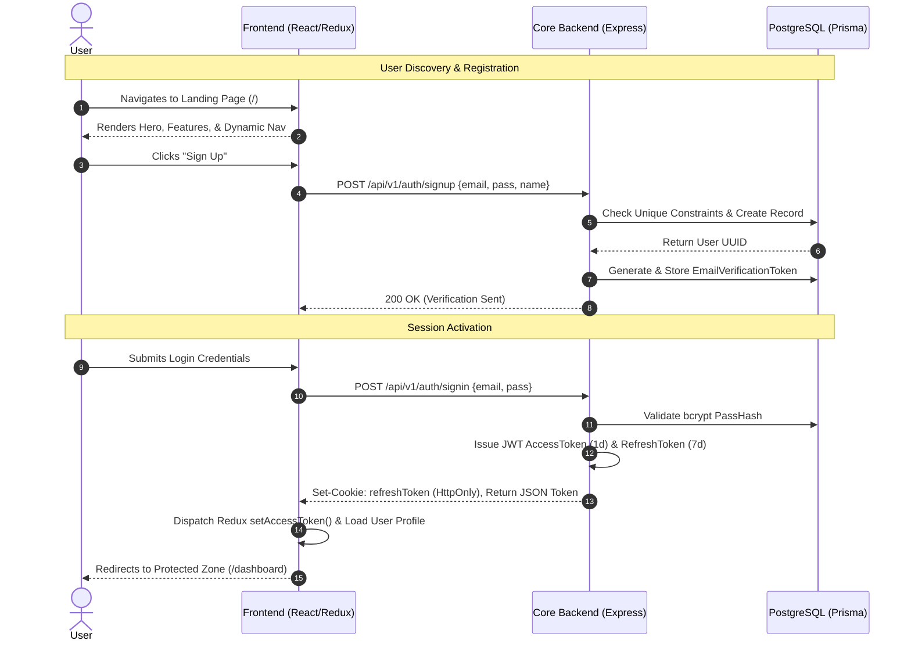
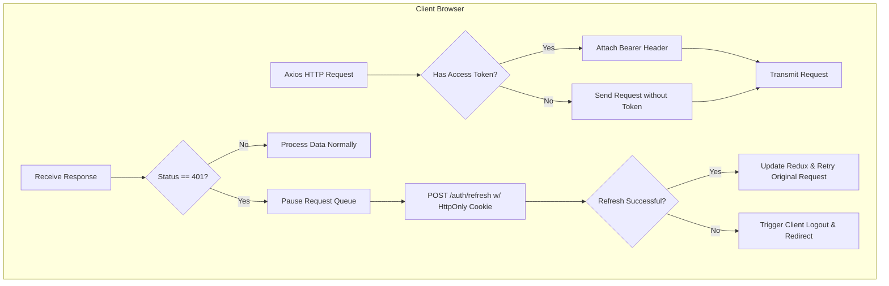
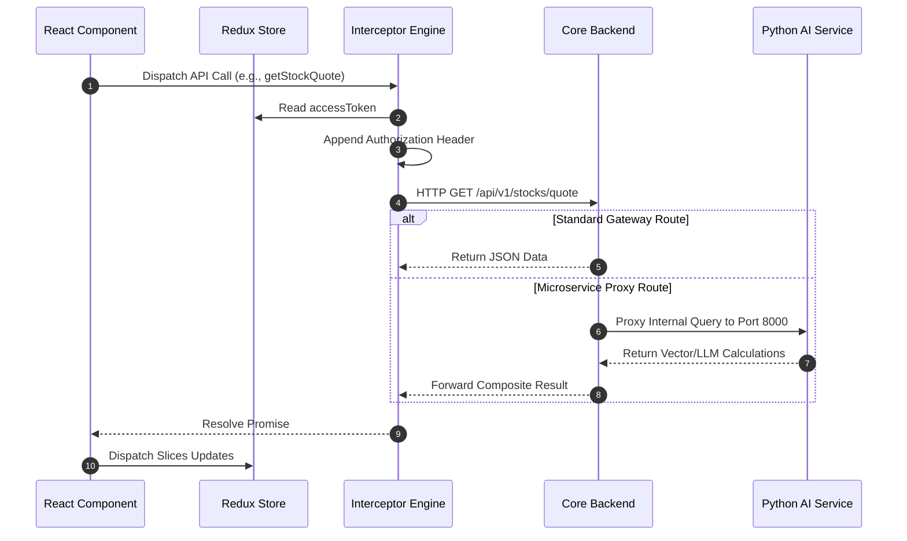
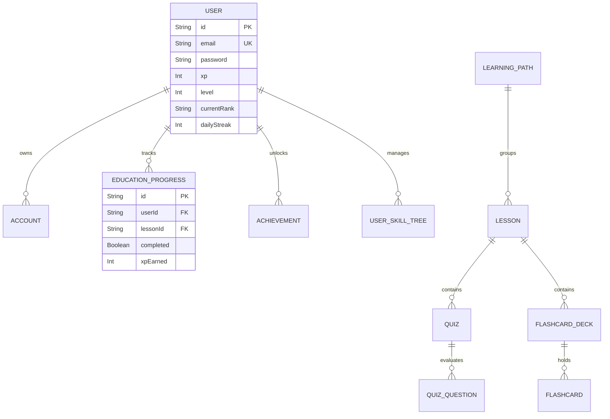
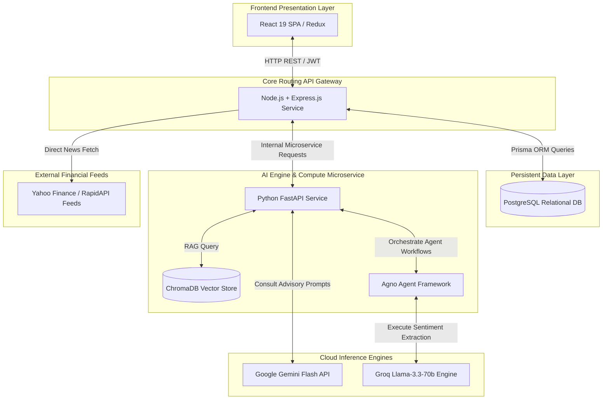

# 📘 AuraFinance Ecosystem: Complete Master Project Flow Documentation

**Author:** Core Architecture & Technical Engineering Team  
**System Classification:** Enterprise SaaS Working Architecture, User Journey Flow, & Onboarding Bible  
**Target Audience:** New Developers, QA Engineers, Security Auditors, Product Managers, Investors, & Clients  

---

## 📋 Table of Contents

1. [Phase 1 — Project Overview](#phase-1--project-overview)
2. [Phase 2 — Full User Journey Flow](#phase-2--full-user-journey-flow)
3. [Phase 3 — Dashboard Feature Flows](#phase-3--dashboard-feature-flows)
4. [Phase 4 — Authentication & Security Flow](#phase-4--authentication--security-flow)
5. [Phase 5 — Frontend & Backend Communication](#phase-5--frontend--backend-communication)
6. [Phase 6 — Database & Data Flow](#phase-6--database--data-flow)
7. [Phase 7 — AI & Analytics Flow](#phase-7--ai--analytics-flow)
8. [Phase 8 — Routing & Navigation Flow](#phase-8--routing--navigation-flow)
9. [Phase 9 — System Architecture Visualization](#phase-9--system-architecture-visualization)
10. [Phase 10 — New Developer Onboarding Guide](#phase-10--new-developer-onboarding-guide)
11. [Phase 11 — Document Maintenance & Expansion Guidelines](#phase-11--document-maintenance--expansion-guidelines)

---

## Phase 1 — Project Overview

### 1. What AuraFinance Is
**AuraFinance** is a state-of-the-art, AI-augmented modular financial technology ecosystem. It provides real-time multi-asset market intelligence, portfolio aggregation, automated sentiment analytics, and gamified financial education tailored for both novice learners and professional investors.

### 2. Main Purpose of the Platform
Traditional finance tools present uninterpreted numerical charts, leaving users to decipher dense raw datasets. AuraFinance solves this by actively digesting real-time stock, ETF, crypto, and Forex metrics through advanced **Large Language Models (LLMs)** and **Retrieval-Augmented Generation (RAG)** pipelines. Simultaneously, it incentivizes continuous financial literacy through structured experience points (XP), learning streaks, achievement unlockables, and interactive tiered progression paths.

### 3. Core Modules & Features
*   **Comprehensive Portfolio Dashboard:** Centralized tracking of positions, capital allocations, and historical returns with automated snapshot refreshes.
*   **Real-Time Sentiment Intelligence:** Targeted extraction of financial news articles processed by dedicated Agent teams to output instant Bullish/Bearish/Neutral metrics.
*   **Context-Aware AI Assistant:** Conversational engine querying localized Vector embeddings and general macroeconomic indices to provide personalized asset consulting.
*   **Market Dynamics Heatmaps:** Interactive performance visualizers across Equities, Global Currencies (Forex), Exchange Traded Funds (ETFs), and Digital Assets (Crypto).
*   **Gamified EdTech Engine:** Structured lesson trees, randomized interactive quizzes, automated flashcard reviews, and challenging scenario simulations.

### 4. Technologies Used
*   **Frontend Layer:** React 19, TypeScript, Vite, Tailwind CSS, Recharts, Framer Motion, Redux Toolkit, React Router v6.
*   **Core Backend Service:** Node.js, TypeScript, Express.js, Prisma ORM, Passport.js, Nodemailer, JSON Web Tokens (JWT).
*   **AI & Analytical Service:** Python 3.10+, FastAPI, Google Gemini Flash API (`gemini-1.5-flash`), Agno Agentic Framework, Groq Inference Engine (`llama-3.3-70b-versatile`), ChromaDB Persistent Database.
*   **Data Persistence Layer:** PostgreSQL relational cluster managed via Prisma ORM schemas.

### 5. Frontend Architecture
The client application is built around a highly responsive **Single Page Application (SPA)** architecture bundled using Vite. State is managed via a centralized Redux store segregated into feature-based slices (`authSlice`, `portfolioSlice`). Layout wrapping isolates global navigations (`MainLayout`) from internal authenticated zones (`DashBoardLayout`), utilizing contextual dynamic themes and robust component boundaries to maintain responsive layouts across desktop, tablet, and mobile views.

### 6. Backend Architecture
The backend ecosystem implements a modern **Service-Oriented Architecture (SOA)** divided into two primary processing engines:
1.  **Core Node.js Engine:** Serves as the principal state gateway handling user validation, session tokens, database transactions, portfolio records, and gamification calculations over HTTP/REST and WebSocket protocols.
2.  **Python AI Service Engine:** Operates as a stateless microservice optimized for vectorized matrix math, LLM API orchestration, web scraping, and real-time market data ingestion via third-party wrappers.

### 7. Python AI Service Role
The Python service acts as the foundational analytical engine. Exposing localized FastAPI routes on port `8000`, it manages direct connections to LLM providers to evaluate live financial articles, calculates historical standard deviations for equity charts, and operates custom memory-injected Chat sessions matching financial term dictionaries with live market variables.

### 8. Database Role
The persistent data store leverages a high-availability **PostgreSQL** instance. Designed around optimized foreign keys, cascading entity deletions, and compound unique constraints, the DB acts as the absolute source of truth for dynamic entities including multi-provider account credentials, detailed module progression states, granular sub-holding ledgers, and achievement tracking logs.

### 9. Authentication System Overview
Security is guaranteed through an asymmetric dual-token approach. Short-lived Access Tokens are persisted statelessly in application memory, while rotating Refresh Tokens are locked inside strict, HTTP-only Secure browser cookies. OAuth federated flows interface seamlessly with Passport.js callbacks to link single-sign-on providers directly to underlying UUID records.

### 10. Third-Party Integrations
*   **Market Feed Providers:** Yahoo Finance engine wrappers (`yfinance`) and direct real-time API integrations.
*   **LLM Providers:** Google DeepMind Gemini API endpoints and Groq serverless acceleration backends.
*   **Communication Delivery:** Nodemailer SMTP transport layers dispatching transactional validation strings.

---

## Phase 2 — Full User Journey Flow



### 1. Landing Page Behavior
*   **User Sees:** Vibrant glassmorphic user interface featuring animated technology nodes, orbital hero elements, dynamic stock tickers, value proposition blocks, and clear Call-To-Action buttons.
*   **Frontend Action:** Renders component tree utilizing Framer Motion optimizations. No authentication calls are executed; standard public headers apply.
*   **Backend Action:** Idles; static asset requests resolve locally or from accelerated edge delivery layers.

### 2. Navbar Navigation
*   **User Sees:** Top utility bar housing dynamic context buttons. Unauthenticated users see *Sign In* / *Get Started*. Authenticated users see custom User Avatars, live XP trackers, current Level insignias, and navigation drop-downs.
*   **Frontend Action:** Intercepts route navigation. Reads Redux state (`isLoggedIn`) to swap navigation views dynamically.
*   **Backend Action:** Stateless validation of contextual navigation components.

### 3. Signup Flow
*   **User Sees:** Clean modal input fields requesting Username, Email, Password, and Confirmation. Real-time client-side error flags display on incorrect input shapes.
*   **Frontend Action:** Validates data schema locally via custom validation handlers. Dispatches asynchronous registration thunk to core API layer.
*   **Backend Action:** Express router intercepts request. Queries database to verify email availability. Executes CPU-intensive password hashing via `bcryptjs`. Generates random validation token strings, commits token records to relational table, and invokes standard asynchronous SMTP transport pipelines to deliver confirmation payloads.
*   **Database Operations:** `INSERT INTO "User"` and `INSERT INTO "EmailVerificationToken"`.
*   **Outcome Handling:** On success, UI switches to a confirmation screen prompting inbox review. On failure (e.g., duplicated entry), toast notifications output descriptive conflict messaging.

### 4. Login Flow
*   **User Sees:** Authentication form requesting registered Email and Password.
*   **Frontend Action:** Posts payload to `/api/v1/auth/signin`. Captures resulting raw JSON token and user records.
*   **Backend Action:** Pulls target User entity. Evaluates hashed strings. Generates dual cryptographically signed JWT strings. Attaches HTTP-only flag to long-lived refresh tokens and injects Set-Cookie parameters into connection headers.
*   **Database Operations:** Read-only query mapping email criteria to active records.
*   **Outcome Handling:** On success, client Redux store ingests context variables (`accessToken`, `user`) and invokes client-side React Router redirects to `/dashboard`. On invalid passwords, 400 Bad Request triggers visual input highlights.

### 5. OAuth Login Flow
*   **User Sees:** Federated login trigger options (*Continue with Google*, *Continue with GitHub*).
*   **Frontend Action:** Directly navigates target window to external OAuth provider authorization URLs.
*   **Backend Action:** Passport.js middleware validates return payload strings against configured client keys. Resolves underlying profile models, automatically generates matching relational accounts or updates active entries, injects corresponding Secure authorization tokens into state cookies, and issues HTTP status 302 redirects targeting the authenticated client zone.

### 6. Dashboard Loading Flow
*   **User Sees:** Full-screen optimized loading state displaying smooth spinners while application aggregates portfolio and gamification states.
*   **Frontend Action:** Invokes parallel requests matching summary endpoints. Mounts custom interceptors.
*   **Backend Action:** Resolves compound relational queries mapping user contexts to granular internal modules.

### 7. Protected Route Behavior
*   **User Sees:** Persistent application layouts containing left navigation structures and top global control strips.
*   **Frontend Action:** Component wrap layer (`ProtectedRoute`) verifies presence of Access Tokens. If empty, triggers automated silent validation sweeps or forces authentication redirection.
*   **Backend Action:** Evaluates incoming HTTP Bearer Strings against runtime application secret parameters.

### 8. Session Handling
*   **User Sees:** Uninterrupted state operations across multiple open browser tabs.
*   **Frontend Action:** Implements Axios response catch logic. On receiving HTTP status 401 Unauthorized, automatically blocks outbound queue, requests `/refresh` token extraction via HttpOnly Secure context cookies, updates global Redux references, and replays intercepted queued instructions.
*   **Backend Action:** Verifies cryptographic refresh validity. Returns updated short-lived JWT variables without requesting manual password credentials.

### 9. Logout Flow
*   **User Sees:** Seamless transition to main public portal with immediate clearing of personalized layout metrics.
*   **Frontend Action:** Dispatches Redux slice cleanup command (`logout()`). Destroys dynamic memory pointers.
*   **Backend Action:** Optionally marks refresh tokens dead or instructs browser engines to expire target domain cookie strings via updated cache directives.

---

## Phase 3 — Dashboard Feature Flows

### 1. Portfolio Management
*   **Purpose:** Comprehensive financial balance aggregation tracking historical equity distributions.
*   **UI Behavior:** Renders top summary cards detailing Net Portfolio Value, absolute Profit/Loss margins, and total active entries. Below, multi-tab layout controls interactive Recharts display arrays and tabular edit modules.
*   **Backend/API Communication:** Communicates directly via authenticated requests to Core backend portfolio management APIs.
*   **State Management:** Governed by `portfolioSlice.ts`. Maintains arrays of custom `Holding` interfaces alongside continuous performance logs.
*   **User Interactions:** Allows dynamic creation, update, and deletion of custom asset positions via inline modal controllers.
*   **Data Flow:** Local additions update memory maps instantly while dispatching async queue instructions to ensure underlying persistent synchronization.

### 2. News & Sentiment Analysis
*   **Purpose:** Real-time global market awareness backed by instant automated sentiment inference.
*   **UI Behavior:** Multi-column headline lists displaying formatted company tag blocks. Clicking an article triggers dedicated analytical loading interfaces.
*   **Backend/API Communication:** Node.js backend pulls external news feeds and exposes proxy endpoints. Sentiment extraction instructions route directly to Python microservice endpoints (`/api/v1/sentiment/sentiment`).
*   **State Management:** Component-level dynamic parsing mapping returned raw markdown structures to responsive inline blocks.
*   **Data Flow:** Python microservice leverages **Agno Agent** architecture powered by **Groq** (`llama-3.3-70b-versatile`) to scrape requested URLs, strip layout artifacts, and output formatted markdown with classification reasons.

### 3. AI Chatbot
*   **Purpose:** Context-aware expert advisory engine.
*   **UI Behavior:** Persistent floating chat window or dedicated screen housing chat bubbles, pre-populated prompt recommendation cards, and inline table rendering capabilities.
*   **Backend/API Communication:** Node service proxies user statements to Python FastAPI endpoints (`/api/v1/chatbot/chat`).
*   **State Management:** Session identifiers persist across calls to maintain context history stored within the internal server layer.
*   **Data Flow:** Python routes extract historical conversations, evaluate queries against custom localized definitions (`financial_knowledge.py`), formulate detailed prompt wrappers, and query Google **Gemini Flash** APIs (`gemini-1.5-flash`). Node service independently triggers XP rewards (e.g., +5 XP) upon successful response generation.

### 4. Currency Converter
*   **Purpose:** High-precision cross-border currency translation calculations.
*   **UI Behavior:** Dual selection drop-downs featuring flag iconography alongside real-time comparative value arrays.
*   **Backend/API Communication:** Requests resolve via dedicated Node controller endpoints matching `/api/v1/currency`.
*   **Data Flow:** Core backend routes interface with fast exchange-rate services to return highly cacheable JSON rate objects.

### 5. Stock Analysis
*   **Purpose:** Granular deep-dive into specific enterprise valuations.
*   **UI Behavior:** Detailed charting interface visualizing Moving Averages alongside full company balance-sheet abstracts.
*   **Backend/API Communication:** Queries interface directly with Python FastAPI stock routing logic (`/api/v1/stocks/quote`, `/api/v1/stocks/history`).
*   **Data Flow:** Python engine accesses dynamic data layers (via optimized caching or live Yahoo Finance interfaces) to construct highly structured, rounded numeric output maps.

### 6. ETF Heatmaps
*   **Purpose:** Visual aggregation of sector-wide funds performance metrics.
*   **UI Behavior:** Dynamic block matrices where individual cell sizing correlates with total fund size and color shading represents relative daily gains/losses.
*   **Backend/API Communication:** Pulls dynamic structural configuration parameters.
*   **State Management:** Managed via component local properties handling user zoom and categorization events.

### 7. Crypto Heatmaps
*   **Purpose:** Instant graphical tracking of volatile digital assets.
*   **UI Behavior:** High-contrast mosaic UI detailing live ticker variables across leading network tokens.
*   **Data Flow:** Client interfaces execute highly efficient state ingestion pipelines. Care is taken to ensure client cleanup hooks remove residual script tags to prevent DOM leaks.

### 8. Learning/Education Modules
*   **Purpose:** Enterprise EdTech framework delivering progressive learning tracks.
*   **UI Behavior:** Visual learning tree paths populated by color-coded lesson nodes. Locked items present grayscale interfaces until preceding conditions are satisfied.
*   **Backend/API Communication:** Interfaces via authenticated paths targeting `/api/v1/education/lesson`.
*   **Data Flow:** Resolving a module invokes atomic transactional operations updating `EducationProgress` schemas while incrementing total user experience pools.

### 9. Flashcards
*   **Purpose:** High-retention micro-learning review systems.
*   **UI Behavior:** Animated card components supporting 3D flip translations revealing conceptual definitions.
*   **Backend/API Communication:** Fetches deck models from `/api/v1/education/flashcard`.
*   **State Management:** Tracks internal deck iteration arrays locally inside client memory.

### 10. Skill Challenges
*   **Purpose:** Advanced assessment verification mechanics.
*   **UI Behavior:** Scenario description portals providing multi-variable financial decision-making arrays.
*   **Data Flow:** High-tier reward parameters trigger custom XP allocation events upon validation success.

### 11. Quizzes
*   **Purpose:** Direct metric evaluations confirming knowledge comprehension.
*   **UI Behavior:** Question paginators supporting single and multi-select radio interfaces backed by instantaneous correct/incorrect validation banners.
*   **Backend/API Communication:** Calls `/api/v1/education/quiz` controllers.
*   **Data Flow:** Client POSTs selected array models; backend evaluates accuracy percentages, calculates dynamic reward scalars, and writes updated level values.

### 12. User Profile
*   **Purpose:** Global identity representation zone.
*   **UI Behavior:** Editable layout housing avatars, editable biographies, achievement trophy display racks, and current ranking badges.
*   **Data Flow:** Submits update records to authenticated endpoints to write directly to Prisma entity targets.

### 13. Premium Features
*   **Purpose:** Gatekeeping mechanism unlocking advanced quantitative features.
*   **UI Behavior:** Conditional layout arrays rendering exclusive options when underlying verification tags return True.

### 14. Community Features
*   **Purpose:** Social interactive elements supporting client engagement.
*   **UI Behavior:** Public display lists or localized discussion spaces.

### 15. Notifications
*   **Purpose:** Asynchronous system state updates.
*   **UI Behavior:** Floating toast alerts overlaying current interfaces via unified notification frameworks (`NotificationService`).

### 16. Settings
*   **Purpose:** Customization of user experience environments.
*   **UI Behavior:** Option arrays controlling dynamic UI modes, account management controls, and default portfolio parameters.

---

## Phase 4 — Authentication & Security Flow



### 1. JWT Authentication Flow
The framework employs an enterprise-grade asymmetric lifetime protocol. Upon valid credentials verification, the Node backend cryptographically signs two distinct JSON Web Tokens:
*   **Access Token:** Signed using `ACCESS_JWT_SECRET` with a lifespan of exactly **1 day** (`1d`). This token is returned in standard JSON response payloads and stored purely in the client's transient Redux state.
*   **Refresh Token:** Signed using `REFRESH_JWT_SECRET` with an extended lifespan of **7 days** (`7d`).

### 2. Refresh Token Flow
To protect against persistent token extraction via XSS vectors, the Refresh Token is never accessible to client-side scripts. It is securely injected into connection streams via Set-Cookie headers using strict transport configurations:
```http
Set-Cookie: refreshToken=<token>; HttpOnly; Secure; SameSite=Lax; Path=/
```
When an Access Token expires, API calls return `401 Unauthorized`. The application's global Axios interceptor catches this response, halts the outgoing task queue, and silently invokes a POST to `/api/v1/auth/refresh`. The browser automatically transmits the locked Secure cookie. Upon validation, the server responds with a fresh Access Token, seamlessly continuing user activity.

### 3. OAuth Flow
Federated providers (Google, GitHub) route through secure callback endpoints controlled by Passport.js strategies. Upon user authorization, providers return profile properties to the backend. The core server resolves or initializes appropriate Prisma records, directly injects long-lived authorization cookies, and executes standard client redirects back to `/dashboard`.

### 4. Protected Route System
Client route wrappers evaluate the Redux state variable `accessToken`. If unauthenticated paths attempt traversal into internal areas, React components intercept the routing operation, output descriptive notification alerts, and execute programmatic redirects to the authentication views.

### 5. Session Persistence
By utilizing `SameSite=Lax` along with appropriate HTTP-only Cookie structures, authentication sessions persist naturally across internal reloads and tab closures without risking authorization leakage to cross-origin subdomains.

### 6. Cookie Handling
Cookies are managed strictly via backend response layers. Client side applications contain zero logic attempting manual extraction, modification, or parsing of cryptographic cookie strings.

### 7. Authorization Checks
Internal backend middleware (`authUser`) evaluates token integrity prior to passing request lifecycles to target controllers. Requests missing valid cryptographic signatures are blocked at the router boundary with standard HTTP status code formats.

### 8. Logout/Session Destruction
Triggering client logouts immediately unsets dynamic state properties inside client memory. Sub-systems reset back to initialized baseline variables, terminating local functional capacity until valid user credentials are provided.

---

## Phase 5 — Frontend & Backend Communication



### 1. React Frontend to Node Backend Communication
Client interactions rely on robust typed promise chains. Outbound API requests map to localized base URLs via configurable environment configurations (`VITE_API_BASE_URL`).

### 2. Node Backend to Python AI Service Communication
When client instructions necessitate machine learning analysis, web scraping, or vector retrieval tasks, the Node backend functions as an internal microservice proxy, seamlessly forwarding payload variables to internal Python listener ports.

### 3. API Request Lifecycle
1.  User clicks UI element.
2.  Component triggers internal asynchronous actions.
3.  Axios interceptor attaches session properties.
4.  Network transports deliver requested data packets.
5.  Backend processes and returns targeted JSON arrays.
6.  Client promise resolution unsets local loading variables.

### 4. Axios Interceptor Behavior
Configured inside `axiosInstance.ts`, client execution logic attaches valid Bearer strings automatically. Response interceptors handle automated replay behavior dynamically on encountering expired token boundaries.

### 5. Error Handling Flow
Errors return structured status codes accompanied by detailed JSON message descriptions. Global UI utilities read these parameters to present context-aware error overlays without crashing target layout interfaces.

### 6. Response Parsing
Incoming response blocks undergo typed structural verification prior to injection into client state boundaries.

### 7. Loading State Management
Boolean state flags toggle dynamically across application layers, maintaining UI responsiveness via smooth intermediate loaders while network transactions process.

### 8. Redux Store Updates
State updates utilize Redux Toolkit reducers, guaranteeing predictable single-direction data flow updates across active client interfaces.

---

## Phase 6 — Database & Data Flow



### 1. Prisma ORM Role
Prisma operates as the principal high-performance data abstraction layer. Type safe schema documents (`schema.prisma`) guarantee absolute parity between application interface definitions and persistent relational structures.

### 2. PostgreSQL Structure
The primary database maintains strict referential integrity. Foreign key references enforce automatic cascade deletion lifecycles, guaranteeing clean relational spaces when account profiles are deleted.

### 3. User Data Flow
User models maintain continuous incremental attributes including experience counters (`xp`), hierarchical rank string flags (`currentRank`), and sequential daily retention markers (`dailyStreak`).

### 4. Portfolio Data Flow
Internal database structures allow complex sub-ledgers tracking individual position purchases, supporting dynamic average-cost calculations across diverse user holding arrays.

### 5. Quiz/Education Data Flow
Completing lessons updates compound distinct record layers (`userId_lessonId`), writing verification updates while synchronously updating primary user experience variables.

### 6. AI/Vector Database Flow
Text content and financial knowledge blocks convert to multi-dimensional floating point embeddings mapped directly inside persistent vector database indexes.

### 7. ChromaDB Role
ChromaDB functions as the localized persistence engine (`chroma.sqlite3`). It allows highly optimized nearest-neighbor similarity searches matching conversational context arrays with historical financial metrics.

### 8. Data Persistence Lifecycle
Updates process through transactional wrappers (`prisma.$transaction`), guaranteeing complete operational integrity across relational schemas.

---

## Phase 7 — AI & Analytics Flow

### 1. Gemini AI Integration
The framework integrates directly with Google Generative AI endpoints. Configuring local module environments with specific access keys (`GOOGLE_API_KEY`) enables the system to utilize high-performance Flash inference models (`gemini-1.5-flash`).

### 2. Chatbot Workflow
1.  Client submits raw natural language strings.
2.  Backend routing mechanisms route requests to active server endpoints.
3.  Session utilities pull historical message arrays to inject context references.
4.  Internal processing layers scan target text blocks against predefined financial dictionaries.
5.  Composite prompts formulate, requesting concise structural responses accompanied by suitable markdown formatting.
6.  LLM inference completes; client UI elements ingest resulting textual output blocks.

### 3. Sentiment Analysis Workflow
1.  Client passes specific URL pointers targeting financial articles.
2.  Service logic invokes advanced Agent structures (`get_sentiment_agent`).
3.  Agents scrape raw document nodes, stripping unneeded layout framing.
4.  Targeted inference processes output strict structural schemas detailing directional sentiment classifications.

### 4. Vector Search Workflow
Embeddings match query strings against high-dimensional vector representations to return highly relevant context sections supporting downstream generative processes.

### 5. Python FastAPI Architecture
Stateless microservice design principles allow horizontal scalability, ensuring low-latency query handling across compute-heavy matrix math pipelines.

---

## Phase 8 — Routing & Navigation Flow

### 1. Full Route Map
```text
[Root Wrapper]
 ├── / (Public Landing Page)
 ├── /News (Global Market Intelligence)
 ├── /map (Nearby Utility Finder)
 ├── /About, /Features, /Premium, /Pricing, /Community (Marketing Layouts)
 ├── /profile, /faq, /feedback (User & Utility Space)
 ├── /education (EdTech Core Dashboard)
 │    ├── /education/practice/flashcards/:deckId
 │    ├── /education/challenge/:challengeId
 │    └── /education/quiz/:quizId
 ├── /login, /SignUp (Authentication Gateways)
 ├── /verifymail, /verifymail/:verificationToken (Validation Paths)
 ├── /forgot-password, /reset-password/:resetToken (Recovery Paths)
 └── [Protected Zone]
      └── /dashboard (Authenticated Portal)
           ├── /dashboard/news
           ├── /dashboard/analysis
           ├── /dashboard/finance-chatbot
           ├── /dashboard/currencyconvertor
           ├── /dashboard/stock-heatmap
           ├── /dashboard/crypto-heatmap
           ├── /dashboard/etf-heatmap
           ├── /dashboard/forex-heatmap
           ├── /dashboard/portfolio
           ├── /dashboard/financial-calculator
           └── /dashboard/tax-center
```

### 2. Dashboard Navigation Flow
Authenticated zones wrap inside structural layouts providing clean sidebar navigation controls. Context preservation hooks ensure active feature views maintain focus across inter-module navigation operations.

### 3. Fallback/404 Flow
Unmatched route matching patterns route gracefully to unified custom fallback views (`NotFound`), offering clean return navigation options back to parent zones.

---

## Phase 9 — System Architecture Visualization

### 1. Comprehensive System Architecture Diagram


---

## Phase 10 — New Developer Onboarding Guide

### 1. How to Run the Project Locally
The framework provides unified local startup automation capabilities. To initialize the complete development environment simultaneously:
```cmd
cd AuraFinance/FinTechForge-main
run-all.bat
```
Alternatively, developers can execute specific microservice startup commands independently across dedicated terminal sessions:

**Database Startup:** Ensure local PostgreSQL instances operate correctly and populate matching access keys inside base configuration files.

**Python AI Service Startup:**
```bash
cd backend-python
python -m venv venv
source venv/bin/activate  # On Windows: venv\Scripts\activate
pip install -r requirements.txt
uvicorn main:app --reload --port 8000
```

**Node.js Backend Startup:**
```bash
cd backend-node
npm install
npm run dev  # Initiates local ts-node listener processes on port 5050
```

**React Frontend Startup:**
```bash
cd frontend-react
npm install
npm run dev  # Initiates local Vite optimization server layers on port 5173
```

### 2. Environment Setup
Create dedicated `.env` configuration files across targeted sub-service roots:
*   `backend-node/.env`: Requires `DATABASE_URL`, `ACCESS_JWT_SECRET`, `REFRESH_JWT_SECRET`, and federated application keys.
*   `backend-python/.env`: Requires `GOOGLE_API_KEY` and `GROQ_API_KEY`.
*   `frontend-react/.env`: Requires `VITE_API_BASE_URL` and target backend routing string paths.

### 3. Core Folder Structures
*   `backend-node/src/auth/`: Contains core validation, session mapping, and cookie injection layers.
*   `backend-node/src/FinanceEducation/`: Contains structural lesson parsing logic alongside XP progression metrics.
*   `backend-python/app/api/routes/`: Houses targeted microservice routes processing Chat sessions and external sentiment operations.
*   `frontend-react/src/store/`: Contains centralized Redux Toolkit state slice structures.

---

## Phase 11 — Document Maintenance & Expansion Guidelines

To preserve architectural document integrity during ongoing software development life cycles:
1.  **Strict File Reference Syncing:** Ensure any future structural codebase refactoring updates matching sequence references listed inside this documentation.
2.  **Zero-Placeholder Policy:** Maintain exhaustive, literal technical explanations across all added sub-module documentation scopes.
3.  **Mermaid Rendering Stability:** Always wrap newly added diagram node definitions with explicit quotation delimiters to guarantee clean rendering performance across diverse preview environments.

---
*End of Complete Project Flow Documentation.*
