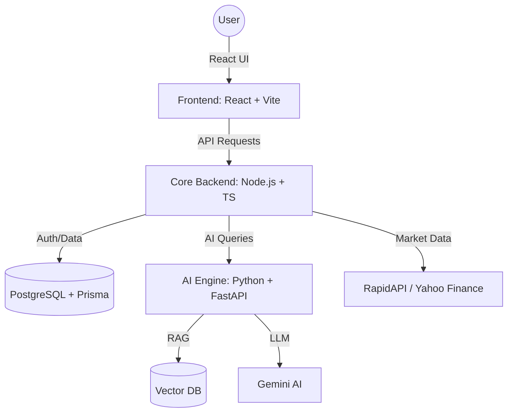

# 🚀 AuraFinance: The Ultimate Project Bible

AuraFinance is a state-of-the-art, modular financial ecosystem designed to bridge the gap between complex financial data and actionable AI insights. This guide provides an exhaustive deep dive into every corner of the project.

---

## 🌟 1. Executive Summary
AuraFinance is built for the modern investor and student. It doesn't just show data; it **interprets** it. By combining a robust Node.js backend for secure user management, a high-performance Python engine for AI processing, and a sleek React frontend, AuraFinance creates an ecosystem where:
- **AI** analyzes market sentiment in real-time.
- **Education** is gamified to help users learn finance while earning XP.
- **Security** is paramount, using industry-standard JWT and OAuth systems.


---

## 🏗️ 2. Technical Architecture & Tech Stack

### High-Level Architecture


### Stack Breakdown
- **Frontend**: React 19, TypeScript, Tailwind CSS, Recharts (Charts), Framer Motion (Animations), Redux Toolkit (State Management).
- **Core Backend**: Node.js, TypeScript, Express, Prisma ORM, Passport.js (OAuth), Nodemailer (Emails).
- **AI Backend**: Python 3.10+, FastAPI, Google Gemini AI (LLM), ChromaDB (Vector Search), LangChain.
- **Database**: PostgreSQL (Atlas/Local).

---

## 📂 3. Folder Structure
```text
AuraFinance/
├── backend-node/         # Node.js Backend (TypeScript)
│   ├── prisma/           # Database Schema
│   └── src/
│       ├── auth/         # Login, Signup, OAuth
│       ├── FinanceNews/  # News & Sentiment Logic
│       ├── FinanceChatbot/ # Chatbot Proxy
│       └── FinanceEducation/ # Gamification & Lessons
├── backend-python/       # AI Engine (Python)
│   ├── app/api/routes/   # AI Chat & Sentiment Endpoints
│   └── db/               # Vector Database (Chroma)
└── frontend-react/       # UI (React)
    └── src/
        ├── pages/        # Dashboard, Education, Analysis
        └── store/        # Redux State (Auth, UI)
```

---

## 🔄 4. The Flow Encyclopedia (Detailed)

### 🔐 A. Authentication & Session Flow
The platform uses **JWT (JSON Web Tokens)** with a secure session strategy.
1.  **Signup**: User registers -> Node.js hashes password -> Sends verification email via Nodemailer.
2.  **Login**: User submits credentials -> Node.js issues:
    - **Access Token**: Returned in JSON (stored in Redux).
    - **Refresh Token**: Stored in a secure, **HTTP-only cookie**.
3.  **Silent Refresh**: When a user refreshes the page, the Frontend calls `/refresh`. Node.js checks the cookie and issues a new Access Token automatically.
4.  **OAuth**: Google/GitHub flows redirect users to Node.js, which authenticates them and redirects back to the Dashboard with a token.
5.  **Logout**: Frontend clears Redux state and deletes the Access Token.

### 📈 B. Market Intelligence Flow
1.  **News Fetch**: Node.js pulls headlines from Yahoo Finance (RapidAPI).
2.  **Sentiment Request**: Frontend asks for analysis on a specific news article.
3.  **AI Processing**: Node.js proxies the URL to the Python Backend.
4.  **Gemini AI**: Python uses Gemini to analyze the article and return a "Positive/Negative/Neutral" sentiment score.

### 🤖 C. AI Finance Chatbot (RAG)
1.  **User Query**: *"Should I invest in Apple?"*
2.  **Context Retrieval**: Python searches **ChromaDB** for recent Apple financial reports.
3.  **Synthesis**: Gemini AI combines the user query + reports context to generate a factual, expert response.
4.  **XP Reward**: After the response, Node.js awards the user **5 XP** for "Exploring AI Tools".

### 🎓 D. Gamification & Education
1.  **Lessons**: User completes a finance lesson on the `/Education` portal.
2.  **Quizzes**: User submits a quiz -> Node.js calculates score.
3.  **XP & Tiers**: Successful completions award XP, which triggers rank updates:
    - **Novice** (0) -> **Saver** (500) -> **Planner** (1200) -> **Investor** (2500) -> **Strategist** (4000) -> **Expert** (6000) -> **Guru** (8500).
4.  **Achievements**: Node.js checks for milestones (e.g., "5 Lessons Completed") and unlocks digital badges.

---

## 💾 5. Database Schema (Prisma Models)
| Model | Purpose | Key Fields |
| :--- | :--- | :--- |
| **User** | Core user profile | email, password, currentRank, xp, dailyStreak |
| **Lesson** | Educational content | title, category, xpReward, quizzes |
| **EducationProgress** | Tracks user learning | userId, lessonId, completed, xpEarned |
| **Achievement** | User milestones | title, earnedAt, userId |
| **Account** | OAuth providers | provider, providerAccountId, userId |

---

## 🖥️ 6. Page-by-Page Guide

### Public Pages
- **Home (`/`)**: Landing page with platform overview.
- **About/Features/Pricing**: Marketing content.
- **Login/SignUp**: Secure auth portals.

### User Dashboard (Protected)
- **Main Dashboard (`/dashboard`)**: Financial summaries and XP stats.
- **News (`/dashboard/news`)**: Sentiment-tagged headlines.
- **Analysis (`/dashboard/analysis`)**: Technical stock charts and indicators.
- **Market Trends**: Interactive heatmaps for Stocks, Crypto, and Forex.
- **Education Hub (`/education`)**: Interactive lessons and quizzes.

### Utility Tools
- **Currency Converter**: Real-time rate conversion.
- **ATM Locator**: Map-based service finder.
- **Financial Calculator**: ROI, SIP, and Tax tools.

---

## 🚀 7. Quick Setup Guide
1.  **DB**: Ensure PostgreSQL is running and set `DATABASE_URL` in `backend-node/.env`.
2.  **Python Backend**: `pip install -r requirements.txt` -> `uvicorn main:app --reload` (Port 8000).
3.  **Node Backend**: `npm install` -> `npm run dev` (Port 5050).
4.  **Frontend**: `npm install` -> `npm run dev` (Port 5173).

---

*AuraFinance is more than a tool—it's your AI-powered financial companion.*
